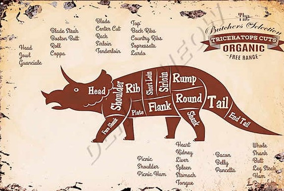

# Livre de recettes

## Crêpes du chef

### Ingrédients :
-       2 œufs d’autruche.
-       45 g de marie jeanne.
-       2 verres de lait de Kangourou.
-       1 verre de jus de chaussette.
-       100 g de poudre de perlimpinpin. 
-       Une dose de vaccin Pfizer.
 
### Temps de cuisson : 
 
-    Laisser cuire la pâte dans une poêle de chaque côté environ 1 minute à 120°C.
 
### Étapes de préparation : 
 
-   Prendre un saladier afin d’y mettre 45 g de Marie Jeanne.
-   Y ajouter les 100 g de poudre de perlimpinpin.
-   Casser les œufs d’autruches et ajouter les à la préparation.
-   Verser les 2 verres de lait de kangourou puis le verre de jus de chaussette ainsi que la dose de vaccin Pfizer.
-   Prendre un fouet homogénéiser la solution afin d’obtenir une pâte onctueuse sans grumeau.
-    Passer à la cuisson : Laisser cuire la pâte dans une poêle de chaque côté environ 1 minute à 120°C.
-   Aiguiser vos papilles et passer à la dégustation.

## Pudding à l’arsenic

### Ingrédients :
-       3 cuillères à soupe de sang de lézard
-       2g de fruit confit
-       2 cuillère à soupe de vert de gris
-       3 quartier d’orange
-       5g d’arsenic
-       1 verre de 33cl de pétrole
-       5mg de mort au rat
-       5 goutte de venin de cobra
-       9ml de vitriole

### Temps de cuisson :
* 30 min à 180°C

### Etapes de préparation
* Dans un grand plat versait du sang de lézard
* Dans un plat à part mélanger les fruit confit dans du vert de gris
* Presser 3 quartier d’orange
* Mélanger l’arsenic puis ajouter le contenu du second plat
* Faire cuire à la casserole le verre de pétrole
* Ajouter la mort au rat puis le venin de cobra
* Ajouter le pétrole
* Laisser reposer 15 min
* Lorsque la pâte redevient molle ajoutez le vitriole
* Placer votre pudding au four pendant 30min
* Démouler votre plat, le gâteau est prêt 

## LE TRICERATOPOULET : #

### Ingrédients : ##

-       Poulet bleu des montagnes (300 g)

-       Riz des îles Galapagos (400 g)

-       Tomates noires de Madagascar (100g)

-       Ail et persil frais (30g)

-       2 œufs de tricératops

### Temps de cuisson :
* 12min à 2000°C

###  Préparation: ##

* Pour cuire les œufs de tricératops il vous faut un four à pizza que vous préchauffez pendant 1h afin d’atteindre les 400°C. Faites cuire les œufs pendant 2 jours et 2 nuits.

* Hachez menu les tomates avec l’ail et le persil puis fourrez le poulet avec votre mixture (après l'avoir vidé).

* Cuire le poulet farci au barbecue après l’avoir badigeonné avec vos œufs de tricératops. Vous devez le laisser sur le barbecue jusqu’à extinction des dernières braises.

* Mettez l’eau à bouillir à 2000°C et cuisez le riz pendant 12 min.

* Enfin jeter le riz et le poulet cramé et commandez un bon uber eats

* Vous n'aurez plus qu'à déguster !

## Recette de buche de noël au chocolat

### Ingrédients :

#### Pour le biscuit :

-       4 œufs
-       70 g farine
-       1 cuillere à soupe de levure chimique
-       50 g sirop d’agave

#### La garniture :

-       120 g chocolat noir
-       180 g crème de soja

#### Le glaçage : 

-       60 chocolat noir
-       2 càs purée de noisette
-       120 g crème de soja

### Temps de cuisson :
* 13 min à 160°C

### Etapes de préparation

#### La garniture :

* Faite fondre la crème de soja dans une casserole puis ajouter le chocolat noir jusqu’à ce que celui-ci fonde.

#### Le biscuit :

* Séparer les blancs des jaunes d’œufs. Monter les blancs en neige.
* Mélanger les jaunes d’œufs avec le sirop d’agave, la levure chimique et la farine jusqu’à obtenir une préparation homogène.
* Incorporer les blancs en neige délicatement avec une spatule. 
* Verser la préparation sur une feuille de papier cuisson sur une plaque du four.
* Enfourner pendant 13 min, puis à la sortie du four décoller la génoise du papier cuisson.

#### Assemblage et glaçage :

* Verser la garniture sur le rectangle de génoise, puis rouler la buche dans le sens de la largeur. Réserver au réfrigérateur pendant au moins 3 heures.
* Pour réaliser le glaçage, faite chauffer la crème de soja dans une casserole. Lorsque celle-ci est chaude, ajouter le chocolat en morceaux. Enfin ajouter la purée de noisette, et bien mélanger la préparation.
* Placer la buche sur une grille, puis verser le glaçage dessus. Réserver au réfrigérateur pendant au moins 2 heures avant de servir.

